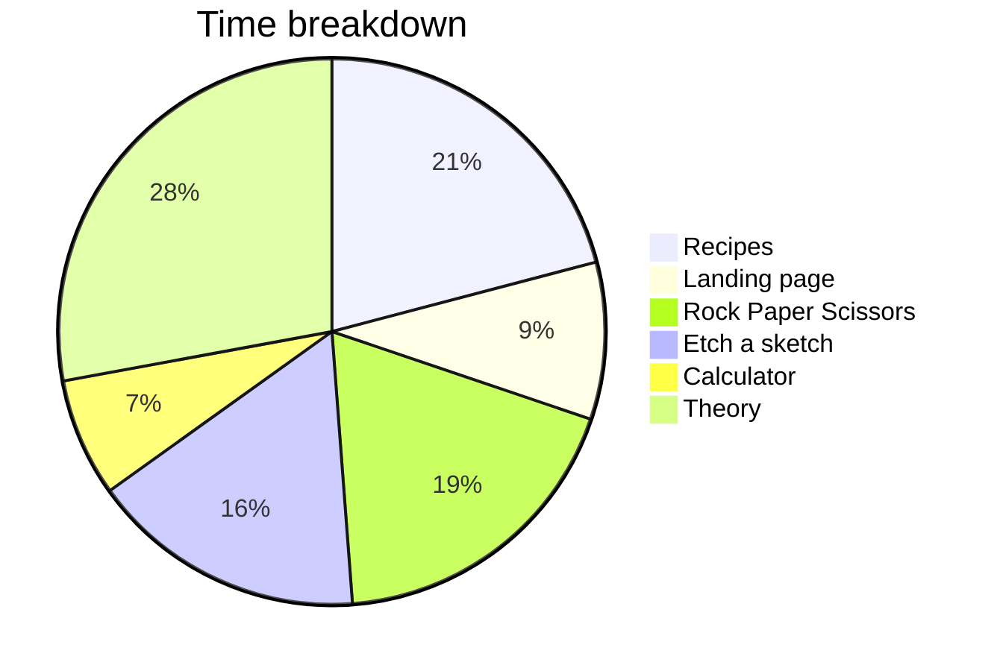

 
On 19th June 2022, I officially began my web development journey with the help of The Odin Project (TOP), a free open-source  course.
 
# Almost abandoning TOP
 
I must admit, as a Windows user,  I seriously considered finding another web development course after reading the following :
 
> **We [The Odin Project] can only support what is provided within the scope of our curriculum. We do not support native Windows or any version of Windows Subsystem for Linux (WSL) as a development environment.**
>
> -- [From the Installation guide](https://www.theodinproject.com/lessons/foundations-installation-overview#concerned-about-installing-a-new-os)
>
 
At first, I was quite hesitant to replace Windows with Linux because I did not want to reinstall all my apps. Other options like dual booting and virtual machines did not appeal to me because of performance issues and the complexity.
 
After doing some research, I decided to go against the tide and install WSL and so far I am getting the best of both worlds : an easy-to-setup Linux environment while being able to keep my Windows apps.
 
> I highly recommend following this [Fireship lesson](https://fireship.io/lessons/windows-10-for-web-dev/) to set up WSL easily.
{: .prompt-tip}
 
# Course quality
 
## Pros
I won't say much here. There are already hundreds of good reviews of TOP and I whole-heartedly agree with them. You can read some of them [here](https://www.reddit.com/r/learnprogramming/comments/u6rrz9/why_is_everyone_recommending_the_odin_project/).
## Things not covered in Foundations
 
- **UI/UX design** : The course will not teach you how to create a  website design from scratch or how to choose the correct color palette for your website. You will either have to learn these things on your own or take inspiration from existing websites on the internet.
- **Responsive design** : This topic is covered only in the later stages of the full stack course so unless you self-learn it, your websites will not look great on different screen sizes.
- **Search-engine-optimization** : You will not learn how to improve the discoverability of websites on search engines. This will limit the traffic to your projects.
- **CSS animations** : This topic is covered only in the full stack course.
- **Writing a good Github README** : I have seen a lot of great TOP projects which are held back by their mediocre README consisting of only 1-2 lines.
 
> Unlike some other online courses TOP does **not** give you any certificates. However this should not be a deciding factor since most online certificates are worthless.
{: .prompt-warning}
 
# Statistics
 
The amount of time you take to complete the Foundations course totally depends on the amount of work you put in. In my case, I took 2 months (43 days of work to be exact)  to complete the Foundations course (19 June 2022 - 20 August 2022).
 
## Things to keep in mind
- I had previous programming experience in VB.NET, C++ and Python which probably made learning JavaScript easier.
- I skipped some of the additional resources found in the course.
- I was free at that time (no work/school) and on some days I managed to put in 8-10 hours of work.
- I devoted most of my time to the projects. Some projects took as long as 1 week of work.
 
## Timeline
 

 
### Recipe project (9 days)
 
**27 June** : Built project with pure HTML.
 
**28 June** : Built 2nd version of project with pure HTML and CSS.
 
**2-3 July** : Built 3rd version with Flexbox for practice.
 
**21-25 July** : I was not satisfied with the previous version and started from scratch again to build a 4th version.

### Landing page project (4 days)
 
**7-10 July** : Built a responsive Landing page with flexbox and media queries.

 
### Rock Paper Scissors project (8 days)
 
**12-19 July** : Learned CSS animations from Youtube to  build the project.
 
 

### Etch-a-sketch project (7 days)
 
**25-31 July** : I implemented "complex" features like Paint bucket fill, Undo/Redo. This was a fun project to work on.

 

### Calculator project (3 days)
**13-15 August** : I did not want to spend too much time on this project but I still wanted to create something totally different from others. I finally settled for a basic version of an abacus.

This project served as inspiration for my [advanced abacus project](https://creme332.github.io/abacusLite/).
 
> You can view all my projects [here](https://creme332.github.io/my-odin-projects/).
{: .prompt-tip}
 
# Advice for myself if I had to restart over
- Join the TOP discord and seek feedback on my projects.
- Do not feel intimidated by the projects found in the Solutions section.
- It's ok to take breaks.
- Create a github [project template](https://docs.github.com/en/repositories/creating-and-managing-repositories/creating-a-template-repository) to save time on setting up your projects.
 

